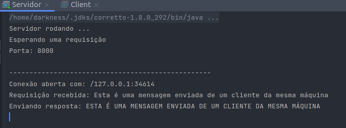
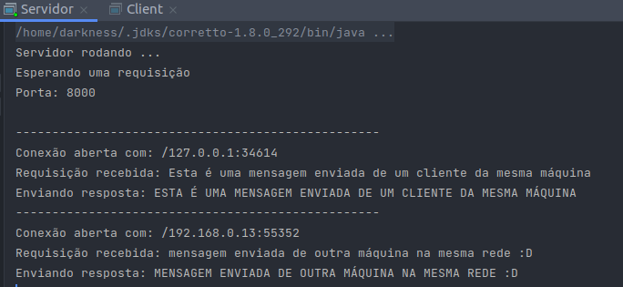
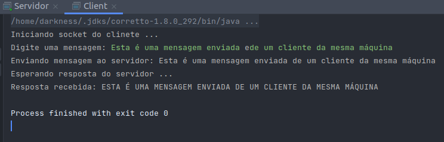
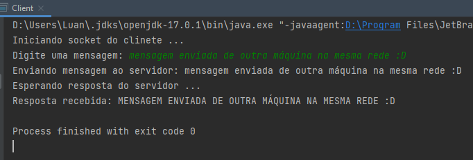

# Cliente e Servidor UDP 

### Imagens servidor:

* Recebendo uma mensagem de um cliente na mesma máquina (local host)

* Recebendo uma mensagem de um cliente em máquina remota conectada na 
mesma rede (192.168.0.13)

### Imagens cliente:

* Enviando mensagem da mesma máquina (local host)

* Enviando uma mensagem de um cliente em máquina remota conectada na
  mesma rede (192.168.0.13)

